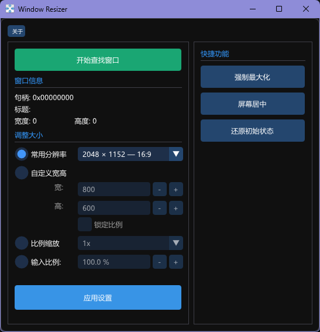

# WindowResizer-ImGui

A lightweight tool to quickly resize any window with a beautiful ImGui-based interface.

轻量级窗口调整工具，基于 ImGui 构建的精美界面。

---

## Features / 功能特性

- Quick window resizing with common resolution presets
- 常用分辨率预设，快速调整窗口大小
- Custom width/height input with aspect ratio lock
- 自定义宽高输入，支持锁定比例
- Scale windows by percentage
- 按比例缩放窗口
- Force maximize and center window
- 强制最大化、窗口居中
- Restore original window size
- 还原窗口初始大小
- Beautiful dark theme ImGui UI
- 精美的深色主题 ImGui 界面
- Single file executable, no dependencies
- 单文件可执行程序，无需依赖

## Screenshot / 程序截图



## Build / 编译

### Requirements / 环境要求

- Visual Studio 2022 (v143 toolset)
- Windows SDK
- DirectX 9 SDK (usually included with Windows SDK / 通常已包含在 Windows SDK 中)

### Build Steps / 编译步骤

1. Open `WindowResizer-imgui.sln` in Visual Studio
2. Select `Release | x64` configuration
3. Build solution
---
1. 在 Visual Studio 中打开 `WindowResizer-imgui.sln`
2. 选择 `Release | x64` 配置
3. 生成解决方案

The output executable will be in `project\Release\WindowResizer-imgui.exe`

编译后的可执行文件位于 `project\Release\WindowResizer-imgui.exe`

## Usage / 使用方法

1. Run `WindowResizer-imgui.exe`
2. Click "开始查找窗口" button
3. Click on the target window you want to resize
4. Select resize mode and click "应用设置"
---
1. 运行 `WindowResizer-imgui.exe`
2. 点击"开始查找窗口"按钮
3. 点击要调整的目标窗口
4. 选择调整模式并点击"应用设置"

## Project Structure / 项目结构

```
WindowResizer-ImGui/
├── src/
│   └── main.cpp                              # Main application code / 主程序代码
├── imgui/
│   ├── backends/
│   │   ├── imgui_impl_dx9.cpp/h              # DirectX9 backend / DirectX9 后端
│   │   └── imgui_impl_win32.cpp/h            # Win32 backend / Win32 后端
│   └── imgui*.cpp/h                          # ImGui core files / ImGui 核心文件
├── project/
│   ├── WindowResizer-imgui.vcxproj           # VS project file / VS 项目文件
│   └── WindowResizer-imgui.vcxproj.filters   # VS project filters / VS 项目过滤器
├── res/
│   ├── WindowResizer.ico                     # Application icon / 应用图标
│   └── resource.rc                           # Resource file / 资源文件
├── WindowResizer-imgui.sln                   # VS solution file / VS 解决方案文件
├── LICENSE                                   # License file / 许可证文件
├── README.md                                 # This file / 本文件
└── screenshot.png                            # Screenshot / 程序截图
```

## License / 许可证

This project is licensed under the MIT License.

本项目采用 MIT 许可证。

Copyright (c) 2019 inkuang  
Modified by siuzhiyu 2026

See the [LICENSE](LICENSE) file for details.

详见 [LICENSE](LICENSE) 文件。

## Credits / 致谢

- Original author: inkuang (https://github.com/inkuang/WindowResizer)
- ImGui: Omar Cornut (https://github.com/ocornut/imgui)
- ImGui version: siuzhiyu (https://github.com/siuzhiyu/WindowResizer)
